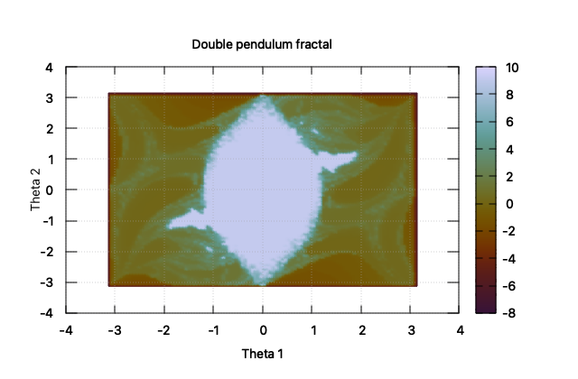

# The Double Pendulum Fractal
Fortran implementation of the double pendulum fractal presented in [1], using OpenMP for parallelism and fplot for plotting.

# References
[1] Heyl, J. S. (2008). The double pendulum fractal. Department of Physics and Astronomy.